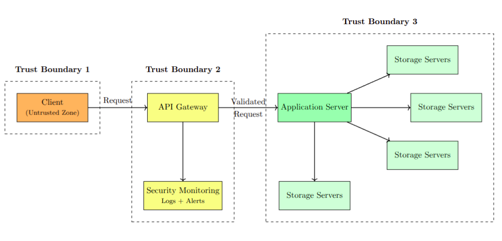

# Secure Cloud Application — Assignment 3

A distributed cloud storage system with **TLS encryption on every channel**, token-based auth, RBAC, automated threat detection, and attack simulations.

---

## Architecture



---

## Quick Start

### Step 1 — Generate TLS Certificates 

```bash
cd source_code/certs
python3 gen_certs.py
```

> Copy `server.crt` to the client machine. Keep `server.key` on servers only.

---

### Step 2 — Start Servers

```bash
python3 storage_servers/storage_server.py 1
python3 storage_servers/storage_server.py 2
python3 storage_servers/storage_server.py 3
python3 storage_servers/storage_server.py 4
python3 application_server/application_server.py
python3 api_gateway/api_gateway.py
```

### Step 3 — Run the Client

```bash
python3 client/client.py
```

---

## Users

| Username | Password | Role | Permissions |
|----------|----------|------|-------------|
| `admin` | `admin123` | Admin | Upload · Download · List · **Delete** |
| `user1` | `user123` | User | Upload · Download · List |
| `readonly` | `read123` | Read-only | Download · List |

---

## Security Features

| Feature | Detail |
|---------|--------|
| **TLS** | RSA-2048 self-signed cert · all sockets wrapped · TLS 1.2+ enforced |
| **Passwords** | SHA-256 hashed server-side — never stored in plaintext |
| **Tokens** | `secrets.token_urlsafe(32)` · IP-bound · 24 h expiry |
| **Rate Limiting** | > 30 req/min per IP → throttled |
| **DoS Protection** | ≥ 100 req/min per IP → auto-blocked for 10 min |
| **Brute-force** | ≥ 5 failed logins → account locked for 5 min |
| **Chunk Integrity** | SHA-256 verified on every read and write (10 MB max) |
| **STRIDE Model** | Automated threat analysis with risk scores |

---

## Attack Simulations

Launch from the client menu:

| Option | Attack | Mitigation Triggered |
|--------|--------|----------------------|
| `6` | Brute-force Login | Account lockout |
| `7` | Denial of Service | IP auto-block |
| `8` | Tampered Token | Token rejection |
| `9` | Replay Attack | IP-binding + expiry check |
| `10` | IDOR | RBAC enforcement |

---

## Monitoring

```bash
python3 monitoring/monitor.py

python3 monitoring/monitor.py --live

python3 security_modules/threat_modeler.py
```

---

## Project Structure

```
source_code/
├── certs/                  ← TLS cert & key (run gen_certs.py first)
├── client/                 ← CLI client + attack simulators
├── api_gateway/            ← TLS reverse proxy, rate limiting, threat detection
├── application_server/     ← Auth, RBAC, file metadata
├── storage_servers/        ← Chunked TLS storage with integrity checks
├── security_modules/       ← Mitigation engine + STRIDE modeler
├── monitoring/             ← Log aggregator & report generator
└── logs/                   ← auth · threats · mitigation · gateway · audit
```
